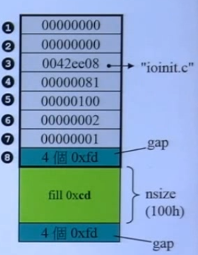
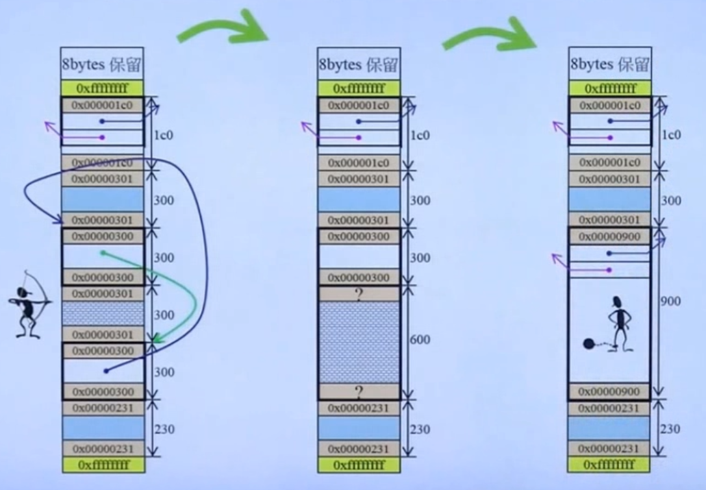

# 内存管理机制

## 1. primitives

|分配|释放|归属于|是否可重载|
|--|--|--|--|
|malloc()|free|C函数|不可|
|new|delete|C++表达式|不可|
|::operator new()|::operator delete()|C++函数|可|
|allocator< T >::allocate()|allocator< T >::deallocate()|C++标准库|自由设计，自由搭配容器|

```cpp
// 测试四种内存分配释放方法
// 1
void* p1 = malloc(512); // 512bytes
free(p1);

// 2
complex<int>* p2 = new complex<int>; // one object
delete p2;

// 3
void* p3 = ::operator new(512); // 内部调用malloc(),分配512bytes
::operator delete(p3); // 内部调用free()

// 4
#ifdef _MSC_VER
// 两函数是non-static,通过object调用，分配三个ints
int* p4 = allocator<int>().allocate(3, (int*)0);
allocator<int>().deallocate(p4, 3);
#endif
#ifdef __BORLANDC__
// 两函数是non-static,通过object调用，分配5个ints
int* p4 = allocator<int>().allocate(5);
allocator<int>().deallocate(p4, 5);
#endif
#ifdef __GNUC__ // 2.9版
// 两函数是static,通过全名调用，分配512bytes
void* p4 = alloc::allocate(512);
alloc::deallocate(p4, 512);
#endif
#ifdef __GNUC__ // 4.9版
// 两函数是non-static,通过object调用，分配7个ints
void* p4 = allocator<int>().allocate(7);
allocator<int>().deallocate((int*)p4, 7);

// 两函数是non-static,通过object调用，分配9个ints
void* p5 = __gnu_cxx::__pool_alloc<int>().allocate(9);
__gnu_cxx::__pool_alloc<int>().deallocate((int*)p5, 9);
#endif
```

### 1.1. new/delete expression

```cpp
Complex* pc = new Complex(1,2);
...
delete pc;
/* new expression */
// Complex* pc = new Complex(1,2)编译器中的执行过程
Complex *pc;
try{ // 因为要分配内存，所以需要考虑分配失败的情况
  // new的操作主要就是下面三步
  void* mem = operator new(sizeof(Complex)); // 分配内存
  pc=static_cast<Complex>(mem); // 将分配的内存转型为想要的形式
  pc->Complex::Complex(1,2); // 通过指针调用构造函数
}catch(std::bad_alloc){
  // 如果allocation失败就不执行constructor
}

// 如果想要直接调用ctor呢？(上面调用ctor是编译器才能进行的操作，不可以自己进行)
// 使用placement new
// new(p)Complex(1,2);

void* operator new(size_t size, const std::nothrow_t&) _THROW0() {
  void *p;
  while((p==malloc(size))==0) {
    _TRY_BEGIN
      if(_callnewh(size)==0)
        break;
      _CATCH(std::bad_alloc)
        return (0);
      _CATCH_END
  }
  return (p);
}

/* delete expression */
// delete pc语句在编译器中的执行过程：
pc->~Complex(); // 先析构
operator delete(pc); // 再释放内存

void __cdecl operator delete(void* p)_THROW0(){
  free(p);
}
```

### 1.2. array new/delete

***如果new了一个数组，delete的时候也要delete掉数组，如果只delete一个会发生内存泄漏问题***

```cpp
Complex* pca = new Complex[3];
// 调用三次ctor

delete[] pca; // 调用三次dtor

```

### 1.3. placement new

***它允许将对象构建于已经分配了内存的空间中***

```cpp
#include <new>
char* buf = new char[sizeof(Complex)*3];
Complex* pc = new(buf)Complex(1,2);

delete[] buf; // placement new 根本没有分配内存，所以实际上并没有placement delete，但是new完了需要delete释放，所以对应的那个就叫做placement delete
// 它被编译器转为
/********************************/
Complex *pc;
try{
  // 这里和普通的new的区别在于buf参数，它是将已经得到了的内存传进来
  void* mem = operator new(sizeof(Complex),buf);
  pc=static_cast<Complex*>(mem);
  pc->Complex::Complex(1,2);
}
catch(std::bad_alloc){}
/********************************/

```

### 1.4. 重载::operator new/::operator delete/operator new/operator delete/operator new[]/operator delete[]

```cpp
/* 接口的使用规格(这仅仅是测试一下，太过简单，里面漏洞也就多) */
void* myAlloc(size_t size)
{
  return malloc(size);
}

void myFree(void* ptr)
{
  return free(ptr);
}

// 它们不可以被声明在一个namespace中
inline void* operator new(size_t size)
{
  cout << " jjs global new() \n";
  return myAlloc(size);
}

inline void* operator new[](size_t size)
{
  cout << " jjs global new[]() \n";
  return myAlloc(size);
}

inline void operator delete(void* ptr)
{
  cout << " jjs global delete() \n";
  myFree(ptr);
}

inline void operator delete[](void* ptr)
{
  cout << " jjs global delete[]() \n";
  myFree(ptr);
}

/* 在类里重载 */
class Foo{
public:
  // 静态的，不需要有对象就可以调用它们
  static void* operator new(size_t);
  static void operator delete(void*, size_t); // 第二参数可有可无
};

Foo* p = new Foo;
// 被编译器转换为
try{
  void* mem = operator new(sizeof(Foo)); // 这个operator new会去调用类内定义的operator new
  p = static_cast<Foo*>(mem);
  p->Foo::Foo(1,2);
}

delete p;
// 被编译器转换为
p->~Foo();
operator delete(p); // 使用类内定义的operator delete
```

***示例***

```cpp
class Foo
{
public:
  int _id;
  long _data;
  string _str;

public:
  Foo():_id(0)
  {
    cout << "default ctor.this=" << this << " id=" << _id << endl;
  }
  Foo(int i):_id(i)
  {
    cout << "ctor.this=" << this << " id=" << _id << endl;
  }

  ~Foo()
  {
    cout << "dtor.this=" << this << " id=" << _id << endl;
  }

  static void* operator new(size_t size);
  static void operator delete(void* pdead, size_t size);
  static void* operator new[](size_t size);
  static void operator delete[](void* pdead, size_t size);
};

void* Foo::operator new(size_t size)
{
  Foo* p = (Foo*)malloc(size);
  cout << "Foo operator new()" << endl;
  return p;
}

void Foo::operator delete(void* pdead, size_t size);
{
  cout << "Foo operator delete()" << endl;
  free(pdead);
}

void* Foo::operator new[](size_t size)
{
  Foo* p = (Foo*)malloc(size);
  cout << "Foo operator new[]()" << endl;
  return p;
}

void Foo::operator delete[](void* pdead, size_t size)
{
  cout << "Foo operator delete[]()" << endl;
  free(pdead);
}

```

### 1.5. 重载new()/delete()

可以重载class member operator new()得到多个版本，有些前提条件

- 每个版本声明有独特的参数列
- 第一参数必须是size_t
- 其余参数是以new所指定的placement arguments为初值
  - placement arguments:就是出现在new()小括号里面的参数

也可以重载class member operator delete()得到多个版本，有些限制条件

- 不会被delete调用
- 只有当new调用的ctor抛出异常，才会调用这些重载版本的operator delete()
  - 这是它被调用的唯一情况，这样来归还正在创建object时占用的内存

***示例***

```cpp
class Foo
{
public:
  Foo()
  {
    cout << "Foo()" << endl;
  }
  Foo(int)
  {
    cout << "Foo(int)" << endl;
    throw Bad();
  }

  // 1.一个一般的operator new()的重载
  void* operator new(size_t size)
  {
    return malloc(size);
  }

  // 2.标准库提供的placement new()的重载形式
  void* operator new(size_t size, void* start)
  {
    return start;
  }

  // 3.自己定义的placement new
  void* operator new(size_t size, long extra)
  {
    return malloc(size_extra);
  }

  // 4.placement new
  void* operator new(size_t size, long extra, caht init)
  {
    return malloc(size_extra);
  }

  // 5.当第一参数不是size_t会报错
  void* operator new(long extra, chart init)
  {
    // [Error]'operator new' takes type 'size_t'('unsigned int') as first parameter [-fpermissive]
    return malloc(extra);
  }

  /* 搭配上面的placement new的placement delete */
  // 1
  void operator delete(void*, size_t)
  {
    cout << "operator delete(void*,size_t)" << endl;
  }

  // 2
  void operator delete(void*, void*)
  {
    cout << "operator delete(void*, void*)" << endl;
  }

  // 3
  void operator delete(void*, long)
  {
    cout << "operator delete(void*, long)" << endl;
  }

  // 4
  void operator delete(void*, long, char)
  {
    cout << "operator delete(void*, long, char)" << endl;
  }

private:
  int m_i;
}
```

### 1.6. per-class allocator

***关于生成一个池来分配内存的操作***

版本1：通过next指针连接池的下一个内存，这样会造成浪费一个指针的空间

```cpp
#include <cstddef>
#include <iostream>
using namespace std;

class Screen
{
public:
  Screen(int x):i(x) {};
  int get()
  {
    return i;
  }

  void* operator new(size_t);
  void operator delete(void*, size_t);

private:
  // 由于多了一个next指针，导致Screen由原来的一个int(4字节)到了8字节
  Screen* next;
  static Screen* freeStore;
  static const int screenChunk;

private:
  int i;
};

Screen* Screen::freeStore = 0;
const int Screen::screenChunk=24;

void* Screen::operator new(size_t size)
{
  Screen *p;
  if(!freeStore){
    // linked list为空，就需要申请一大块内存
    size_t chunk = screenChunk * size;
    freeStore = p = reinterpret_cast<Screen*>(new char[chunk]);
    // 将一大块内存切割成多个小块，使用linked list连接起来
    for(;p!=&freeStore[screenChunk-1];++p)
      p->next=p+1;
    p->next=0;
  }
  p=freeStore;
  freeStore=freeStore->next;
  return p;
}

void Screen::operator delete(void* p,size_t)
{
  // 将deleted object插回free list前端
  (static_cast<Screen*>(p))->next = freeStore;
  freeStore = static_cast<Screen*>(p);
}

```

版本2：使用union，将数据和指针集合在一起

```cpp
class Airplane
{
private:
  struct AirplanRep
  {
    unsigned long miles;
    char type;
  };

private:
  union {
    AirplaneRep rep;
    Airplan* next; // 指向free list的object
  };

public:
  unsigned long getMiles()
  {
    return rep.miles;
  }
  char getType()
  {
    return rep.type;
  }
  void set(unsigned long m, char t)
  {
    rep.miles = m;
    rep.type = t;
  }

public:
  static void* operator new(size_t size);
  static void operator delete(void* deadObject, size_t size);

private:
  static const int BLOCK_SIZE;
  static Airplane* headOfFreeList;
};

Airplane* Airplane::headOfFreeList;
const int Airplane::BLOCK_SIZE = 512;

void* Airplane::operator new(size_t size)
{
  // 判断大小,如果有继承就会导致大小有误
  if(size!=sizeof(Airplane))
    return ::operator new(size);
  
  Airplane* p = headOfFreeList;
  if(p) // 内存池没有枯竭
    headOfFreeList = p->next;
  else {
    // 内存池已经枯竭
    Airplane* newBlock = static_cast<Airplane*>(::operator new(BLOCK_SIZE * sizeof(Airplane)));

    for(int i=1;i<BLOCK_SIZE-1;++i)
      newBlock[i].next = &newBlock[i+1];
    newBlock[BLOCK_SIZE-1].next=0;
    p=newBlock;
    headOfFreeList = &newBlock[1];
  }
  return p;
}

void Airplane::operator delete(void* deadObject, size_t size)
{
  if(deadObject == 0)
    return;
  if(size!=sizeof(Airplane)) {
    ::operator delete(deadObject);
    return;
  }

  // 它最终把内存块回收到了链表上，没有还给操作系统
  Airplane* carcass = static_cast<Airplane*>(deadObject);

  carcass->next = headOfFreeList;
  headOfFreeList = carcass;
}
```

版本3：将一个总是分配特定尺寸大小的memory allocator包装起来，重复使用

```cpp
// 每个allocator object都是一个分配器，它内部维护一个free-lists，不同的allocator objects维护不同的free-lists
class allocator
{
private:
  struct obj {
    struct obj* next;
  };

public:
  void* allocate(size_t);
  void deallocate(void*, size_t);

private:
  obj* freeStore = nullptr;
  const int CHUNK = 5;
};

void allocator::deallocate(void* p, size_t)
{
  // 回收,要把它转换为obj指针(因为不知道把它当作什么指针给分配出去了，所以回收的时候直接统一转换)
  ((obj*)p)->next = freeStore;
  freeStore = (obj*)p;
}

void* allocator::allocate(size_t size)
{
  obj* p;

  if(!freeStore) {
    size_t chunk = CHUNK * size;
    freeStore = p = (obj*)malloc(chunk);

    for(int i=0; i<(CHUNK-1);++i) {
      p->next = (obj*)((char*)p+size);
      p = p->next;
    }
    p->next = nullptr;
  }
  p=freeStore;
  freeStore = freeStore->next;
  return p;
}


// 其他的类需要在内部定义一个静态的allocator对象，需要重载operator new/operator delete方法
class Foo
{
public:
  long L;
  string str;
  static allocator myAlloc;

public:
  Foo(long l):L(l) {}
  static void* operator new(size_t size)
  {
    return myAlloc.allocate(size);
  }
  static void operator delete(void* pdead, size_t size)
  {
    return myAlloc.deallocate(pdead, size);
  }
};
allocator Foo::myAlloc;

class Goo
{
public:
  complex<double> c;
  string str;
  static allocator myAlloc;

public:
  Goo(const complex<double>& x):c(x) {}
  static void* operator new(size_t size)
  {
    return myAlloc.allocate(size);
  }
  static void operator delete(void* pdead, size_t size)
  {
    return myAlloc.deallocate(pdead, size);
  }
};
allocator Goo::myAlloc;
```

***macro for static allocator***

宏定义，它是对版本3的优化，因为外部定义类想要使用统一的allocator时的操作是一样的，所以通过这个来优化

```cpp
// DECLARE_POOL_ALLOC -- used in class definition
#define DECLARE_POOL_ALLOC()
public:
  void* operator new(size_t size)
  {
    return myAlloc.allocate(size);
  }
  void operator delete(void* pdead)
  {
    return myAlloc.deallocate(pdead, 0);
  }
portected:
  static allocator myAlloc;

// IMPLEMENT_POOL_ALLOC -- used in class implementation file
#define IMPLEMENT_POOL_ALLOC(class_name)
allocator class_name::myAlloc;

// 上面的两个类就可以简化为
class Foo
{
  DECLARE_POOL_ALLOC()
public:
  long L;
  string str;
  static allocator myAlloc;

public:
  Foo(long l):L(l) {}
};
IMPLEMENT_POOL_ALLOC(Foo)

class Goo
{
  DECLARE_POOL_ALLOC()
public:
  complex<double> c;
  string str;
  static allocator myAlloc;

public:
  Goo(const complex<double>& x):c(x) {}
};
IMPLEMENT_POOL_ALLOC(Goo)
```

### 1.7. new handler

当operator new没有能力为你分配出你所申请的memory

- 抛出std::bad_alloc异常
- 老版本可能会返回0
  - 可以强制编译器不抛异常：new(nothrow)Foo;

***在抛出异常之前会多次调用一个由client指定的handler***

new handler的形式和设定方法：

```cpp
typedef void(*new_handler)();
new_handler set_new_handler(new_handler p) throw();
```

设计良好的new handler的两种选择

1. 让更多memory可用
2. 调用abort()或exit()

```cpp
#include <new>
#include <iostream>
#include <cassert>
using namespace std;

void noMoreMemory()
{
  cerr << "out of memory";
  abort();
}

new_handler __cdecl set_new_handler(new_handler new_p)
{
  // cannot use stub to register a new handler
  assert(new_p == 0);
  // remove current handler
  _set_new_handler(0);
  return 0;
}

void main()
{
  set_new_handler(noMoreMemory);

  int* p = new int[100000000000000];
  assert(p);

  p = new int[1000000000000000000000];
  assert(p);
}
```

## 2. std::allocator

***VC6标准分配器实现***

```cpp
#ifdef _FARQ
  #define _FARQ
  #define _PDFT ptrdiff_t
  #define _SIZE size_t
#endif

// 所有的容器的分配器都默认是它
template <class _Ty>
class allocator {
public:
  typedef _SIZE size_type;
  typedef _PDFT difference_type;
  typedef _Ty _FARQ *pointer;
  typedef _Ty value_type;

  pointer allocate(size_type _N, const void*)
  {
    return (_Allocate((difference_type) _N, (pointer)0));
  }
  void deallocate(void _FARQ * _P, size_type)
  {
    operator delete(_P); // 可以看到它就是单纯的调用operator delete，没有啥额外操作
  }
}

template<class _Ty>
inline _Ty _FARQ * _Allocate(_PDFT _N, _Ty _FARQ *)
{
  if (_N < 0)
    _N = 0;
  return ((_Ty _FARQ*)operator new((_SIZE)_N * sizeof(_Ty))); // 这个也是直接调用operator new
}
```

***BC5标准分配器实现***

```cpp
template <class T>
class allocator
{
public:
  typedef size_t size_type;
  typedef ptrdiff_t difference_type;
  typedef T* pointer;
  typedef T value_type;

  // 它也是直接使用operator new/operator delete
  pointer allocate(size_type n, allocator<void>::const_pointer = 0) {
    pointer tmp = _RWSTD_STATIC_CAST(pointer, (::operator new(_RWSTD_STATIC_CAST(size_t, (n*sizeof(value_type))))));
    _RWSTD_THROW_NO_MSG(tmp==0,bad_alloc);
    return tmp;
  }
  void deallocate(pointer p, size_type) {
    ::operator delete(p);
  }
};
```

***G2.9标准分配器实现***

```cpp
// G2.9版本，容器默认调用的是alloc，而不是allocator
template <class T>
class allocator {
public:
  typedef T value_type;
  typedef T* pointer;
  typedef size_t size_type;
  typedef ptrdiff_t difference_type;

  // 它也是没有额外操作
  pointer allocate(size_type n) {
    return ::allocate((difference_type)n, (pointer)0);
  }
  void deallocate(pointer p) {
    ::deallocate(p);
  }
};

template <class T>
inline T* allocate(ptrdiff_t size, T*) {
  set_new_handler(0);
  T* tmp = (T*)(::operator new((size_T)(size * sizeof(T))));

  if (tmp==0) {
    cerr << "out of memory" << endl;
    exit(1);
  }
  return tmp;
}
template <class T>
inline void deallocate(T* buffer) {
  ::operator delete(buffer);
}
```

G2.9版本的alloc到G4.9版本为__pool_alloc

***G4.9***

```cpp
class __pool_alloc_base
{
protected:
  enum {_S_align=8};
  enum (_S_max_bytes=128);
  enum {_S_free_list_size = (size_t)_S_max_bytes/(size_t)_S_align};

  union _Obj
  {
    union _Obj* _M_free_list_link;
    char _M_client_data[1];
  };

  static _Obj* volatile _S_free_list[_S_free_list_size];

  static char* _S_start_free;
  static char* _S_end_free;
  static size_t _S_heap_size;
};

char* __pool_alloc_base::_M_allocate_chunk(size_t __n, int& __nobjs)
{
  char* __result;
  size_t __total_bytes = __n * __nobjs;
  size_t __bytes_left = _S_end_free - _S_start_free;
  ...
  __try {
    _S_start_free = static_cast<char*>(::operator new(__bytes_to_get));
  }
  __catch(const std::bad_alloc&) {
    size_t __i = __n;
    for(;__i<=(size_t)_S_max_bytes;__i+=(size_t)_S_align) {
      ...
    }
    _S_start_free = _S_end_free = 0; // 没有分配
    __throw_exception_again;
  }
  _S_heap_size += __bytes_to_get;
  _S_end_free = _S_start_free + __bytes_to_get;
  return _M_allocate_chunk(__n, __nobjs);
}

template <typename _Tp>
class __pool_alloc:private __pool_alloc_base
{};
```

***G2.9***

```cpp
enum {__ALIGN=8};
enum {__MAX_BYTES=128};
enum {__NFREELISTS=__MAX_BYTES/__ALIGN};

template <bool threads, int inst>
class __default_alloc_template // typedef __default_alloc_template<false, 0> alloc;
{
private:
  union obj {
    union obj* free_list_link;
  };

private:
  static obj* volatile free_list[__NFREELISTS];

  static char* start_free;
  static char* end_free;
  static size_t heap_size;
};

template <bool threads, int inst>
char* __default_alloc_template<threads, inst>::chunk_alloc(size_t size, int& nobjs)
{
  char* result;
  size_t total_bytes = size * nobjs;
  size_t bytes_left = end_free - start_free;
  ...
  start_free = (char*)malloc(bytes_to_get);
  if(0==start_free) {
    int i;
    obj* volatile *my_free_list, *p;

    for (i=size; i<=__MAX_BYTES; i+=__ALIGN) {
      ...
    }
    end_free=0;
    start_free=(cahr*)malloc_alloc::allocate(bytes_to_get);
  }
  heap_size += bytes_to_get;
  end_free = start_free + bytes_to_get;
  return (chunk_alloc(size, nobjs));
}
```

### 2.1. G2.9 std::alloc运行模式

***这部分与容器组件的空间分配器可以混合学习***

### 2.2. std::alloc 内存分配

- pool:备用池
- free-list:内存悬挂点
- 申请大小:客户端需要的大小，申请完成后会悬挂在free-list相应的位置

#### 2.2.1. 初始状态


- 16个list将会保存指针指向一块区间
- 第i块表示当分配(i+1)*8bytes大小的块时悬挂处
  - 例如：当要分配64bytes时，会悬挂在7处

```cpp
template <bool threads, int inst>
__default_alloc_template<threads, inst>::obj* volatile 16
__default_alloc_template<threads, inst>::free_list[__NFREELISTS] = {0,0,0,0,0,0,0,0,0,0,0,0,0,0,0,0};

// 令第二级分配器的名称为alloc
typedef __default_alloc_template<flase,0> alloc;
```

#### 2.2.2. 内存申请步骤

1. 先查看pool内剩余大小是否大于申请大小
2. pool内没有就向pool内添加内存
3. 如果向pool内无法添加内存就查看free-list上离它最近的右侧的悬挂点是否悬挂内存
4. 到这里了就分配失败了

#### 2.2.3. 向pool内添加容量的原则

- 向pool内部添加 (申请大小 * 20 * 2 + RoundUp) 大小的内存
  - RoundUp:追加量。大小为：累计申请量>>4
  
- 向pool添加的内存去向：
  - 有(申请大小*20)悬挂在free-list下
    - 1块返回给客户端
    - 19块悬挂在free-list下
  - 剩余部分保存在pool内

- 每次向pool内注入的内存是连在一起的，公用一个cookie来标记
- 虽然它可能被悬挂在free-list的多个位置

#### 2.2.4. 从pool内分配出内存的原则

- 直接分配出1-20块申请大小的内存块，剩余的仍在pool内
- 如果pool内剩余量不够分配一个申请块大小，它会变为碎片悬挂在free-list相应位置

### 2.3. std::alloc 源码剖析

在01-alloc.cpp中

- 第一级分配器:一笔带过，在G4.9把它删掉了
- 第二级分配器:重点

## 3. malloc/free

***CRTStartup，程序的调用流程**

- KERNEL32!bff89f5b()
- KERNEL32!bff8b598()
- KERNEL32!bff8b6e6()(这三个是操作系统进入程序执行的)
- mainCRTStartup()(这个就是startup code)(这才开始C++程序)
  1. _heap_init(...)
     - __sbh_heap_init()  
  2. _ioinit() // initialize lowio
     - _malloc_dbg(...)  
       - nh_malloc_dbg(...)
         - heap_alloc_dbg(...)
           - heap_alloc_base(...)
             - __sbh_alloc_block(...)(SBH的行为，会在3.2中讲解)
               - __sbh_alloc_new_region()
               - __sbh_alloc_new_group(...)
  3. GetCommandLineA()
  4. __crtGetEnvironmentStringsA()
  5. _setargv()
  6. _setenvp()
  7. _cinit() // do C data initialize
     - _initterm(,,) // do initializations
       - __initstdio(void)
     - initterm(,,) // do C++ initializations
  8. main()
  9. exit(code)
     - doexit(code, 0, 0)
       - initterm(,,) // do pre-terminators
         - __endstdio(void)
       - initterm(,,) // do terminators
       - ExitProcess(code)

### 3.1. VC6的首次内存分配

#### 3.1.1. 计算首次分配内存的大小

***ioinit控制第一次分配内存***

从现在开始计算将要分配的内存大小

```cpp
/* Memory block identification */
#define _FREE_BLOCK 0
#define _NORMAL_BLOCK 1
#define _CRT_BLOCK 2
#define _IGNORE_BLOCK 3
#define _CLIENT_BLOCK 4
#define _MAX_BLOCKS 5

#ifndef _DEBUG
#define _malloc_crt malloc
...
#else /* _DEBUG */
#define _THISFILE __FILE__
#define _malloc_crt(s) _malloc_dbg(s,_CRT_BLOCK,_THISFILE,__LINE__)
...
#endif /* _DEBUG */

typedef struct
{
  long osfhnd;
  char osfile;
  char pipech;
}ioinfo;

void __cdecl _ioinit(void)
{
  ...
  // 第一次分配内存的操作，分配了32*8=256(100h)大小的内存
  if((pio=_malloc_crt(IOINFO_ARRAY_ELTS * sizeof(ioinfo)))==NULL)
  ...
}
```

***_heap_alloc_dbg调控内存的分配***

- debug模式下将所有程序的内存使用指针串联
- debuge模式下在_malloc_dbg分配了100h的基础上添加控制元素


blockSize的结构，也就是debuge模式下分配了的内存的结构

- 前面8个：_CrtMemBlockHeader的数据结构
- 中间100h：是从前面传过来的nSize
- 后面一个：nNoMansLandSize

```cpp
#define nNoMansLandSize 4
typedef struct _CrtMemBlockHeader
{
  struct _CrtMemBlockHeader * pBlockHeaderNext;
  struct _CrtMemBlockHeader * pBlockHeaderPrev;
  char* szFileName; // 文件名
  int nLine; // 行号
  size_t nDataSize; // 真正的大小
  int nBlockUse;
  long IRequest; // 流水号
  unsigned char gap[nNoMansLandSize]; // 以字符形成的array，大小为4
  /* flooowed by:
    unsigned char data[nDataSize];
    unsigned char anotherGap[nNoMansLandSize];
  */
}_CrtMemBlockHeader;

static unsigned char _bNoMansLandFill = 0xFD;
static unsigned char _bDeadLandFill = 0xDD;
static unsigned char _bCleanLnadFill = 0xCD;

static _CrtMemBlockHeader * _pFirstBlock;
static _CrtMemBlockHeader * _pLastBlock;

// ioinit()通过调用_malloc_dbg()，然后调用到_heap_alloc_dbg()
// 在_heap_alloc_dbg()内部有对ioinit最初申请的256字节内存做出修改

_heap_alloc_dbg()
{
  ...
  // nSize就是256
  blockSize = sizeof(_CrtMemBlockHeader) + nSize + nNoMansLandSize;
  ...
  pHead = (_CetMemBlockHeader *)_heap_alloc_base(blockSize);
  ...
  // 调试器将所有的这些内存空间串联起来，标记它们
  // 这也就是调试器可以追踪各个内存的原因了
  if(_pFirstBlock)
    _pFirstBlock->pBlockHeaderPrev = pHead;
  else
    _pLastBlock = pHead;

  pHead->pBlockHeaderNext = _pFirstBlock;
  pHead->pBlockHeaderPrev = NULL;
  pHead->szFileName = (char*)szFileName;
  pHead->nLine = nLine;
  pHead->nDataSize = nSize;
  pHead->nBlockUse = nBlockUse;
  pHead->IRequest = IRequest;

  /* link blocks together */
  _pFirstBlock; = pHead;

  /* fill in gap before and after real block */
  memset((void*)pHead->gap, _bNoMansLandFill, nNoMansLandSize);
  memset((void*)(pbData(pHead)+nSize), _bNoMansLandFill, nNoMansLandSize);
  /* fill data with silly value(but non-zero) */
  memset((void*)pbData(pHead), _bCleanLandFill, nSize);
  return (void*)pbData(pHead);
}
```

***_heap_alloc_base***

```cpp
_heap_alloc_base()
{
  ...
  // 设置门槛，决定使用__sbh_lloc_block去分配内存还是用操作系统去分配
  if(size <= __sbh_threshold) { // 3F8,i.e. 1016 ，在这里它是1016，是因为他前后还没有加上8字节的cookie，如果加上就变成了1024
    pvReturn = __sbh_alloc_block(size);
    if(pvReturn) return pvReturn;
  }
  if(size == 0) size = 1;
  size = (size+...)&~(...);
  return HeapAlloc(_crtheap, 0, size);
}
```

***__sbh_alloc_block***

```cpp
// 继续调整要分配内存的大小
// add 8 bytes entry overhead and round up to next para size
// intSize：上层函数传入
// 2*sizeof(int)：上下两个cookie
// round up：调整到16的倍数
sizeEntry = (intSize + 2*sizeof(int) + (BYTES_PER_PARA-1))&~(BYTES_PER_PARA-1);
```

到这里计算好了首次分配的内存的大小：130h

#### 3.1.2. 内存的管理

***由16个HEADER管理全部内存***


16个header的结构

```cpp
// header的数据结构
typedef unsigned int BITVEC;

typedef struct tagHeader
{
  BITVEC bitvEntryHi; // Hi和Lo组合成64位，就是上图的下面那一行
  BITVEC bitvEntryLo;
  BITVEC bitvCommit;
  void* pHeapData; // 指向真实空间
  struct tagRegion* pRegion; // 指向pRegion
}
HEADER, *PHEADER;
```

***__sbh_alloc_new_region***


它就是Header的pRegion指针指向的区域

```cpp
// 它大概16k，用来管理1Mb大小的空间
// region的数据结构
typedef struct tagRegion
{
  int indGroupUse; // 记录当前使用的Group
  char cntRegionSize[64]; // 第一行是64个char类型的元素
  BITVEC bitvFroupHi[32];
  BITVEC bitvGroupLo[32];
  struct tagGroup grpHeadList[32];
}REGION, *PREGION;

// Group的数据结构
typedef struct tagGroup
{
  int cntEntries; // 记录该Group被分出去内存的块数
  struct tagListHead listHead[64];
}GROUP, *PGROUP;

// 它连着8块空间
typedef struct tagListHead
{
  struct tagEntry * pEntryNext;
  struct tagEntry * pEntryPrev;
}LISTHEAD, *PLISTHEAD;

typedef struct tagEntry
{
  int sizeFront;
  struct tagEntry * pEntryNext;
  struct tagEntry * pEntryPrev;
}ENTRY, *PENTRY;

```

### 3.2. 分配

***首次分配***


***二次三次分配也就是按照计算规则进行分配***

***当按照计算规则，此次分配之前回收的位置时的操作：***


- 之前将240分配出去了，后来回收了
- 现在将要分配b0，按照计算要从240中分配出去
- 240分配出去b0，剩余的190通过计算悬挂在Group适当的位置
- 注意：
  - 分配出去b0，但是cookie中为0x000000b01
  - 最后1位为0表示未分配出去
  - 最后1位为1表示已分配出去
  - 每次分配出去16的整数倍，所以每次都是分配出去xx0h

### 3.3. 回收

更改cookie状态，计算回收的位置
通过指针把内存挂上去就可以了


### 3.4. 区块合并

在回收的时候合并相邻区块

在这里就体现出了有上下两块cookie的妙处了



- 与下面相邻的内存合并
  - 通过该内存的上cookie记录的大小，找到下cookie
  - 下cookie也就是它下面那块内存的上cookie
  - 查看它是否空闲，空闲就合并
- 与上面相邻的内存合并
  - 通过该内存的上cookie的边界，找到它上面内存的下cookie
  - 通过它上面内存的下cookie的记录来确定是否能合并

### 3.5. VC6内存管理

内存的分段管理：

- 它有16个Header
- 一个Header有32个Group，一个Header有1Mb内存
- 一个Group分成8块，通过64对指针悬挂，一个Group有32Kb内存
- Group的每块4Kb，但是经过多次分配回收，会被悬挂在多处位置
- 它每次向操作系统实际要32Kb
  - 要一个1Mb的Header是虚要，并没有真正要出内存来

如何判断全回收：

- 回收会合并的，所以全回收就会恢复初始状态
- 八大块全部挂载最后一个指针上面
- 恢复初始状态后不会着急还给操作系统，当手上有两个全回收的时候才会还一个给操作系统
- 它内部有指针(__sbh_pHeaderDefer)，指向一个全回收group所属的Header，这个group暂缓被回收，当有第二个全回收Group出现，SBH释放这个Defer group，并将新出现的全回收Group设为Defer
- 如果没有出现第二个全回收group，但是这时又从Defer group取出block，Defer指针会被取消
- __sbh_indGroupDefer是个索引，指出Region中哪个Group是Defer

## 4. loki::allocator

### 4.1. 三个classes


### 4.2. Chunk

```cpp
void FixedAllocator::Chunk::Init(std::size_t blockSize, unsigned char blocks)
{
  pData_ = new unsigned char[blockSize* blocks]; // 申请区块大小
  Reset(blockSize, blocks); // 添加对区块的控制元素
}

void FixedAllocator::Chunk::Rest(std::size_t blockSize, unsigned char blocks)
{
  firstAvailableBlock_ = 0;
  blockAvailable_ = blocks; // 小区块数量

  unsigned char i = 0;
  unsigned char* p = pData_;
  for(;i!=blocks;p+=blockSize) // 为每个小区块标示索引
    *p = ++i;
}

void FixedAllocator::Chunk::Release()
{
  delete[] pData_; // 释放空间
}

void* FixedAllocator::Chunk::Allocate(std::size_t blockSize)
{
  if(!blocksAvailable_) // 已无空间
    return 0;
  
  // 将它指向第一个可用区块
  unsigned char* pResult = pData_ + (firstAvailableBlock_ * blockSize);

  firstAvailableBlock_ = *pResult;
  --blocksAvailable_; // 可用块减一

  return pResult;
}

void FixedAllocator::Chunk::Deallocate(void* p,std::size_t blockSize) // p指向的是当前要归还的块的位置
{
  unsigned char* toRelease = static_cast<unsigned char*>(p);

  *toRelease = firstAvailableBlock_; // 使要归还的位置内的指针指向现在可以使用的区块的位置，也就是把要归还的块串到块链表的头部
  firstAvailableBlock_ = static_cast<unsigned char>((toRelease-pData_)/blockSize); // 现在可使用区块位置指针

  ++blocksAvailable_; // 可用区块数加1
}
```

### 4.3. FixedAllocator

```cpp
void* FixedAllocator::Allocate()
{
  if(allocChunk_ == 0 || allocChunk_->blocksAvailavle_==0)
  { // 目前没有标定的chunk或该chunk已无可用区块
    Chunks::iterator i = chunks_.begin(); // 从头开始找
    for(;;++i) // 找遍每个chunk，直到找到还有可用的区块的chunk
    {
      if(i==chunks_.end()) // 如果直到尾端还没有找到可用的chunk
      {
        // Initialize
        chunks_.push_back(Chunk()); // 产生a new chunk 挂在尾端 // Chunk()创建temp object拷贝到容器然后结束
        Chunk& newChunk = chunks_.back(); // 使用newChunk指向chunks_的尾端
        newChunk.Init(blockSize_,numBlocks_); // 设置索引
        allocChunk_ = &newChunk; // 标记它，稍后取它的区块
        deallocChunk_ = &chunks_.front();
        break;
      }
      if(i->blocksAvailable_ > 0)
      { // current chunk 有可用区块
        allocChunk_ = &*i; // 取其位址 // ？？？位址是啥？
        // 这里是先对迭代器取值，再取它的地址
        break; // 既然找到了，那就退出把
      }
    }
  }
  return allocChunk->Allocate(blockSize_); // 向这个chunk取区块
}

void FixedAllocator::Deallocate(void* p)
{
  deallocChunk_ = VicinityFind(p); // 找到要回收的位置
  DoDeallocate(p); // 回收
}

// FixedAllocator::VicinityFind(internal)
// Finds the chunk corresponding to a pointer, using an efficient search
FixedAllocator::Chunk* FixedAllocator::VicinityFind(void* p)
{
  const std::size_t chunkLength = numBlocks_ * blockSize_; // 计算chunk的长度

  // 两个查找的初始位
  Chunk* lo = deallocChunk_;
  Chunk* hi = deallocChunk_ + 1;
  // 两个截止位
  Chunk* loBound = &chunks_.front();
  Chunk* hiBound = &chunks_.back()+1;

  // 暴力哲学
  for(;;) { // 兵分两路
    if(lo) { // 上路未到尽头
      if(p>=lo->pData_ && p<lo->pData_ + chunkLength)
        return lo; // p落到lo区间内
      if(lo == loBound) lo=0; // 到头了，让loop结束
      else --lo; // 往lo的front继续找
    }
    if(hi) { // 下路未到尽头
      if(p>hi->pData_ && p<hi->pData_ + chunkLength)
        return hi; // p落在hi区间内
      if(++hi == hiBound) hi=0; // 向着hi的back继续找
    }
  }
  return 0;
}

void FixedAllocator::DoDeallocate(void* p)
{
  deallocChunk->Deallocate(p,blockSize_);

  if(deallocChunk_->blocksAvailable_ == numBlocks_) { // 全回收就是整个chunk都被回收了
    // 确认全回收，那么该release它吗
    // 注意，以下三种情况都重新设定了allocChunk_
    Chunk& lastChunk = chunks_.back(); // 标记最后一个
    // 如果最后一个就是当前的chunk
    if(&lastChunk == deallocChunk_) { // 这个的情况就是最后面两个chunk都被全回收了，需要弹出一个chunk
      // 检查是否会有两个last chunks empty
      // 这只需往front方向看前一个chunk就可以了
      if(chunks_.size()>1 && deallocChunk_[-1].blocksAcailable_ == numBlocks_) {
        // 有2 free chunks 抛弃最后一个
        lastChunk.Release();
        chunks_.pop_back();
        allocChunk_ = deallocChunk_ = &chunks_.front();
      }
      return;
    }
    if(lastChunk.blocksAvailable_ == numBlocks_) { // 这个是前后各有一个
      // 两个free chunks，抛弃最后一个
      lastChunk.Release();
      chunks_.pop_back();
      allocChunk_ = deallocChunk_;
    }
    else { // 这个是后面有一个，把它调换位置
      // 将free chunk最后一个chunk对调
      std::swap(*deallocChunk_, lastChunk);
      allocChunk_ = &chunks.back();
    }
  }
}
```

### 4.4. 优化Loki allocator

- 对之前的暴力循环进行优化
- 使用array取代list，index取代pointer
- 通过记录chunk数量使得可以很简单的判断chunk全回收，进而能够将区块归还给操作系统
- 有Deffering(暂缓归还)的能力
- 有个问题：
  - 它是一个allocator，是用来分配大量的小块不带cookie的memory blocks，它是服务于容器的，但是它本身却使用了vector
  - 那么，到底是它服务于vector还是vector为它提供服务呢？

## 5. other allocators

### 5.1. 简单的分配器

#### 5.1.1. __gnu_cxx::new_allocator

```cpp
template<typename _Tp>
class new_allocator
{
  ...
  pointer allocate(size_type __n, const void* =0){
    if(__n > this->max_size())
      std::__throw_bad_alloc();
    return static_cast<_Tp*>(::operator new(__n*sizeof(_Tp)));
  }
  void deallocate(pointer __p, size_type)
  {
    ::operator delete(__p);
  }  
};
```

#### 5.1.2. VS2013标准分配器new_allocator

```cpp
// 容器使用
template <class _Ty, class _Alloc = allocator<_Ty>>
class list : public _List_buy<_Ty, _Alloc>
{}

// 分配器的主要实现
template <class _Ty>
class allocator : public _Allocator_base<_Ty>
{ // generic allocator for objects of class _Ty
public:
  typedef value_type *pointer;
  typedef size_t size_type;

  void deallocate(pointer _Ptr,size_type)
  { // deallocate object at _Ptr,ignore size
    ::operator delete(_Ptr);
  }

  pointer allocate(size_type _Count)
  { // allocate array of _Count elements
    return (_Allocate(_Count,(pointer)0)); // 它调用外面的那个函数
  }
  pointer allocate(size_type _Count, const void *)
  { // allocate array of _Count elements,ignore hint
    return (allocate(_Count)); // 调用上面的allocate
  }
  ...
};

// TEMPLATE FUNCTION _Allocatr
template <class _Ty> inline _Ty * _Allocate(size_t _Count, _Ty *)
{ // allocate storage for _Count elements of type _Ty
  void * _ptr = 0;
  if(_Count ==0);
  else if ((()(-1)/sizeof(_Ty)<_Count) || (_Ptr = ::operator new(_Count * sizeof(_Ty))) == 0)
    _Xbad_alloc(); // report no memory
  return ((_Ty*)_Ptr);
}
```

#### 5.1.3. G4.9标准分配器new_allocator

```cpp
template <typename _Tp, typename _Alloc = std::allocator<_Tp>>
class vector : protected _Vector_base<_Tp,_Alloc>
{...};

template <typename _Tp>
class allocator:public __allocator_base<_Tp> // 它继承的__allocator_base就是__gnu_cxx::new_allocator
{...};

#define __allocator_base __gnu_cxx::new_allocator
// __gnu_cxx::new_allocator的定义前面已有了
```

#### 5.1.4. __gnu_cxx::malloc_allocator

```cpp
template<typename _Tp>
class malloc_allocator
{
  pointer allocate(size_type __n,const void* = 0) {
    ...
    pointer __ret = static_cast<_Tp*>(std::malloc(__n*sizeof(_Tp)));
  }
  void deallocate(pointer __p,size_type) {
    std::free(...(__p));
  }
};
```

#### 5.1.5. G4.9malloc_allocator

```cpp
template <typename _Tp>
class malloc_allocator
{
  // NB:__n is permitted to be 0. The C++ standard says nothing
  // about what the return value is when __n=0
  pointer allocate(size_type __n, const void* = 0)
  {
    if(__n > this->max_size())
      std::__throw_bad_alloc();
    
    pointer __ret = static_cast<_Tp*>(std::malloc(__n * sizeof(_Tp)));
    if(!__ret)
      std::__throw_bad_alloc();
    return __ret;
  }

  // __p is not permitted to be a null pointer.
  void deallocate(pointer __p, size_type)
  {
    std::free(static_cast<void*>(__p));
  }

  size_type max_size() const _GLIBCXX_USE_NOEXCEPT
  {
    return size_t(-1)/sizeof(_Tp);
  }
  ...
};
```

### 5.2. 智能型

就是挖一大块内存，放到池中，然后分配，池中的内存被程序内所有容器共享，不会经常调用operator new、operator delete，可能会速度有所提升，**不需要cookie**。

#### 5.2.1. __gnu_cxx::bitmap_allocator

```cpp
template <typename _Tp>
class bitmap_allocator:private free_list {
  ...
public:
  pointer allocator(size_type __n) {
    if(__n > this->max_size())
      std::__throw_bad_alloc();
    if(__builtin_expect(__n == 1 true)) // 如果客户需要一个元素，则进行服务，否则，进入operator new
      return this->_M_allocate_single_object();
    else {
      const size_type __b = __n*sizeof(value_type);
      return reinterpret_cast<pointer>(::operator new(__b));
    }
  }

  void deallocate(pointer __p,size_type __n) throw() {
    if(__builtin_expect(__p!=0,true)){
      if(__builtin_expect(__n==1,true)) // 这里也是，客户如果只是一个元素，进入服务，否则进入operator delete
        this->_M_deallocate_single_object(__p);
      else
        ::operator delete(__p);
    }
  }
}
```


***blocks***

一个小空间

***super-blocks***

一大块空间，其中有一堆小blocks

***bitmap***

用来记录blocks的分配情况，置1表示未分配，置0表示已分配

***mini_vector***

用来记录每个大空间


#### 5.2.2. __gnu_cxx::__pool_allocator

就是前面一直在学的

#### 5.2.3. __gnu_cxx::__mt_allocator

#### 5.2.4. __gnu_cxx::debug_allocator

它是一个外覆器(wrapper)，可包覆在任何allocator之上，它本身不做内存分配释放的工作，全部交给它下面的allocator处理，它添加了一小块额外内存存放size信息，在deallocate()的时候，通过assert()检查size，确保大小吻合。

```cpp
template <typename _Alloc>
class debug_allocator
{
  ...
private:
  size_type _M_extra; // 通常是一个size_t
  _Alloc _M_allocator; // 它就是包装了一个allocator

  size_type _S_extra() { // 计算额外需要的空间大小为多少个元素大小。
    const size_T __obj_size = sizeof(value_type); // 它里面的元素的大小
    return (sizeof(size_type) + __obj_size -1) / __obj_size;
  }

public:
  debug_allocator(const _Alloc& __a):_M_allocator(__a),_M_extra(_S_extra())
  {}

  pointer allocate(size_type __n) {
    pointer __res = _M_allocator.allocate(__n + _M_extra); // 这里申请的大小是由容器需要的空间以及debug_allocator所需的存放size的空间所决定的
    size_type* __ps = reinterpret_cast<size_type*>(__res);
    *__ps = __n;
    return __res+_M_extra;
  }

  void deallocate(pointer __p, size_type __n) {
    using std::__throw_runtime_error;
    if(__p) {
      pointer __real_p = __p-_M_extra; // 这是找到debug_allocator分配的真正的空间，__p是可被容器分配的空间，要向前移动出存放size的空间
      if(*reinterpret_cast<size_type*>(__real_p)!=__n)
        __throw_runtime_error("debug_allocator::deallocate wrong size");
      _M_allocator.deallocate(__real_p,__n+_M_extra);
    }
    else
      __throw_runtime_error("debug allocator::deallocate null pointer");
  }
};
```


#### 5.2.5. __gnu_cxx::array_allocator

就是C++的数组，允许分配一块大小固定的内存块，内存来自于std::array objects，用了它就无需自己调用operator new 以及operator delete了。

```cpp
template <typename _Tp, typename _Array=std::tr1::array<_Tp,1>>
class array_allocator : public array_allocator_base<_Tp>
{
public:
  typedef size_t size_type;
  typedef _Tp value_type;
  typedef _Array array_type;

private:
  array_type* _M_array; // 它就是一个指针，指向一个静态的数组
  size_type _M_used;

public:
  array_allocator(array_type* __array = NULL) throw() : _M_array(__array),_M_used(size_type())
  {}

  pointer allocate(size_type __n, const void*=0)
  {
    if(_M_array==0 || _M_used + __n > _M_array->size())
      std::__throw_bad_alloc();
    pointer __ret = _M_array->begin() + _M_used;
    _M_used += __n;
    return __ret;
  }

  // 因为是静态数组，所以不需要管它的释放动作
};

// 使用
using namespace std;
using namespace std::tr1;
using namespace __gnu_cxx;

int main()
{
  //----------------1 C++静态数组-------------------------------
  int my[65536];

  array_allocator<int,(std::tr1::)array<int,65536>> myalloc(&my);

  int* p1 = mymalloc.allocate(1);
  int* p2 = mymalloc.allocate(3);

  mymalloc.deallocate(p1); // 它的父类只是定义了一个空的deallocate，没有具体实现
  mymalloc.deallocate(p2);

  //----------------2 动态分配的方式，但是这两类大体相似的-------------------------------
  typedef ARRAY std::array<int, 65536>;

  ARRAY* pa = new ARRAY;
  array_allocator<int, ARRAY> myalloc(pa);

  int* p1 = myalloc.allocate(1);
  int* p2 = myalloc.allocate(3);

  myalloc.deallocate(p1);
  myalloc.deallocate(p2);

  delete pa;
}
```

### 5.3. allocator对比

GNU C++ 提供三种综合测试，用以完成C++ allocator之间的速度对比：

- Insertion：对容器安插元素的速度快慢，分别测试循序式和开放式容器。
- 多线程环境中的insertion and erasure：多线程中的插入和删除，展示allocator归还内存的能力，以及测量线程之间对内存的竞争。
- A threaded producer/consumer model：分别测试循序式和开放式容器
